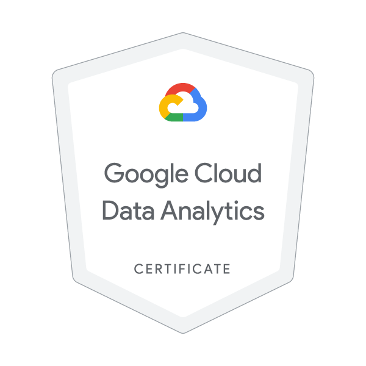

# Name : Divya Shetty
# AI Certifications & Skill Badges Portfolio
This repository is a consolidated portfolio of my verified certifications, skill badges, and training achievements across AI Engineering, Agentic AI, LLMs, RAG, Cloud, and Responsible AI. It serves as a single, easy-to-access location for recruiters, hiring managers, collaborators, and project partners to review my technical qualifications and continuous learning progress in modern AI systems.

---
# 🎯 Purpose of This Repository
#### To showcase verified credentials demonstrating hands-on expertise in:

- Agentic AI & Multi-Agent Systems
- LangGraph, Google ADK, MCP, A2A
- LLM Engineering (Gemini, Vertex AI, LangChain)
- RAG pipelines & source-grounded generation
- AI Security, Reliability & Governance
- Cloud Architecture (Google Cloud Platform)
- Machine Learning & Applied AI
- Responsible AI practices

# 📘 Included Certifications & Badges
## Google Cloud
### 1. Google Cloud Data Analytics Professional:
Validated expertise in building scalable data pipelines, performing advanced SQL analytics, and applying lakehouse architecture principles on Google Cloud. Demonstrates proficiency in ETL/ELT, data modeling, governance, and end‑to‑end analytical solution development using BigQuery and GCP tools.

### 2. Generative AI with Vertex AI Gemini API**

**Prompt Design & Engineering in Vertex AI**

**Responsible AI: Applying AI Principles**

## Google / Kaggle
**AI Agents Intensive Program (2025 & 2026)**

## LangGraph
**Google ADK**
**Multi-agent workflows**
**Memory, observability, security (STRIDE/Semgrep)**
**Specification-driven development**
**Multi-agent orchestration**
**HITL workflows**
**Long-term memory**
**Debugging & observability**
**Production-oriented agent development**

Links to verification pages

🔗 Quick Links
LinkedIn: https://www.linkedin.com/in/divya-shetty-k  

#💡 About Me
**AI Engineer specializing in Agentic AI, Multi-Agent Systems, LLM Applications, RAG, and AI Security. I build production-oriented AI agents using LangGraph, Gemini/Vertex AI, Google ADK, BigQuery, and Python, with strong foundations in testing, observability, and responsible AI.**
