# Name : Divya Shetty
# AI Certifications & Skill Badges Portfolio
This repository is a consolidated portfolio of my verified certifications, skill badges, and training achievements across AI Engineering, Agentic AI, LLMs, RAG, Cloud, and Responsible AI. It serves as a single, easy-to-access location for recruiters, hiring managers, collaborators, and project partners to review my technical qualifications and continuous learning progress in modern AI systems.

---
# 🎯 Purpose of This Repository
To showcase verified credentials demonstrating hands-on expertise in:
- Agentic AI & Multi-Agent Systems
- LangGraph, Google ADK, MCP, A2A
- LLM Engineering (Gemini, Vertex AI, LangChain)
- `Generative AI Foundations, Prompt Engineering & Model Behavior
- `Machine Learning, Deep Learning & TensorFlow
- Python, SQL, R & Big Data Ecosystems
- RAG Pipelines & Source-Grounded Generation
- AI Security, Reliability & Governance
- Cloud Architecture (Google Cloud Platform)
- Data Science & Analytics (EDA, Modeling, Feature Engineering)
- Data Visualization (Looker Studio, D3.js, JavaScript)
- Responsible AI Practices

# 📘 Included Certifications & Badges

## UTSA Data Analytics & Data Science Boot Camp:  
Provides comprehensive training across statistics, Python, R, SQL, big data ecosystems, machine learning, and TensorFlow, preparing students to build end‑to‑end analytical and predictive workflows. Validates hands‑on experience in data visualization with tools like D3.js, JavaScript, and dashboarding platforms, along with practical skills in modeling, feature engineering, and applied data science techniques.

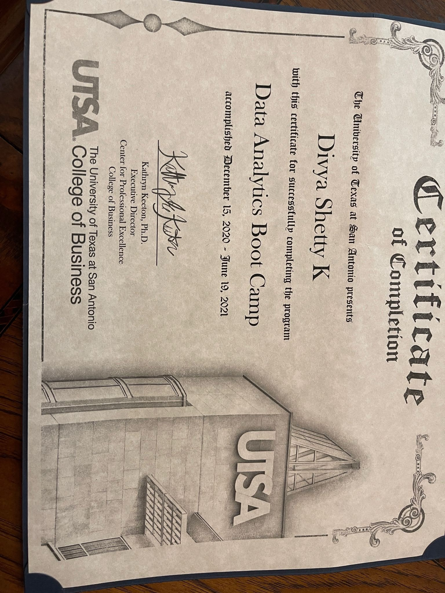

## Google / Kaggle
### AI Agents Intensive Program (2025 & 2026):
Demonstrates hands‑on expertise in building agentic AI systems using LangGraph, Gemini, Google ADK, and multi‑agent orchestration patterns, including memory, tool‑calling, HITL workflows, and secure agent design. Validates practical skills in specification‑driven development, observability, debugging, and implementing real‑world agent workflows aligned with modern AI engineering best practices.

  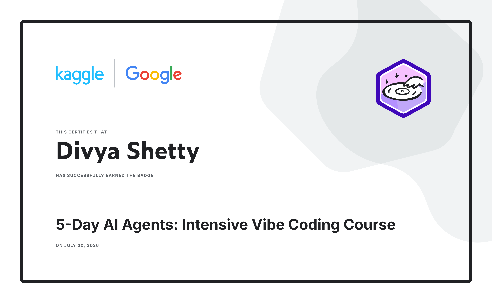
  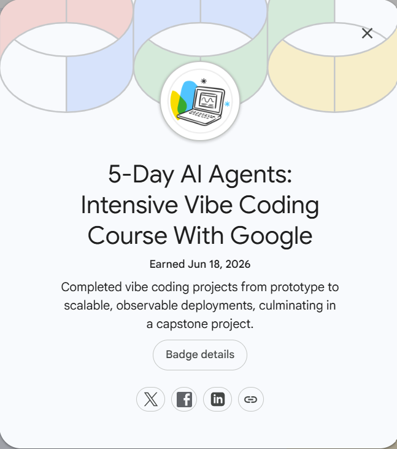

## Google Cloud : [Credly](https://www.credly.com/users/divya-shetty.1085494c), [GoogleSkills](https://www.skills.google/profile/badges?credential_type=skill_badge)
### 1. Google Cloud Data Analytics Professional:
Validated expertise in building scalable data pipelines, performing advanced SQL analytics, and applying lakehouse architecture principles on Google Cloud. Demonstrates proficiency in ETL/ELT, data modeling, governance, and end‑to‑end analytical solution development using BigQuery and GCP tools.

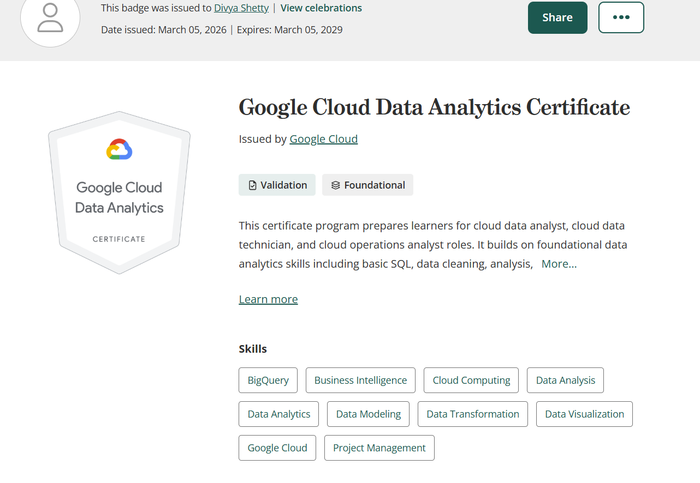

### 2. Generative AI with Vertex AI Gemini API:  
Demonstrates hands‑on proficiency in building multimodal AI applications using the Gemini API, including text, code, image, and structured output generation. Validates skills in function calling, prompt design, and integrating Gemini models into production‑ready workflows using Vertex AI tools and Python SDKs.

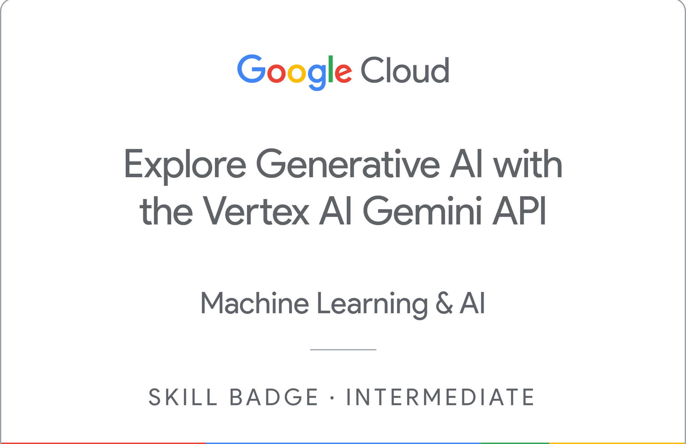

### 3. Google Cloud Data Analytics Certificate:  
Demonstrates validated proficiency in transforming raw data into actionable insights using BigQuery, SQL, and scalable Google Cloud data pipelines. Confirms hands‑on skills in ETL/ELT, data modeling, governance, and building end‑to‑end analytical solutions aligned with modern cloud architecture best practices.

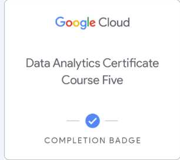

### 4. Gen AI & LLMs: Introduction and Foundational Concepts:  
Provides a strong foundation in how generative AI systems and large language models work, covering core concepts such as embeddings, tokenization, model architectures, multimodal inputs, and responsible AI principles. Demonstrates practical understanding of prompt design, model capabilities and limitations, and how LLMs generate, transform, and reason over text, code, and structured data.

  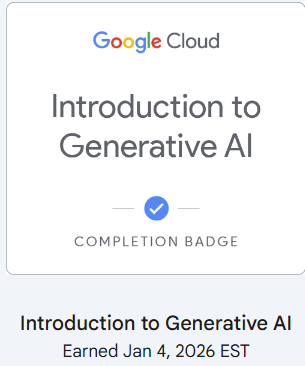
  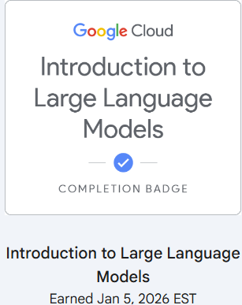
  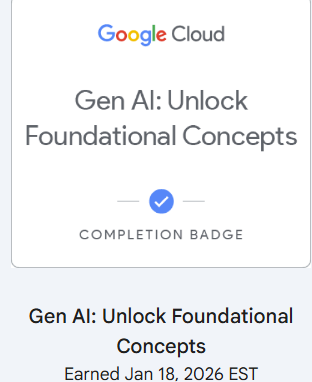

### 4.Prompt Design & Engineering in Vertex AI:
Demonstrates proficiency in designing effective prompts, optimizing model behavior, and structuring inputs for reliable multimodal generation using Vertex AI. Validates hands‑on skills in building, testing, and refining prompt-driven workflows with the Vertex AI Studio, Workbench, and Python SDK for production‑ready AI applications.

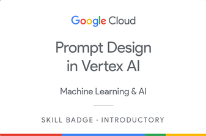

### 5. Responsible AI & Applying AI Principles
Demonstrates practical knowledge of implementing fairness, transparency, privacy, and safety guidelines when designing and deploying AI systems on Google Cloud. Validates hands‑on skills in identifying risks, mitigating bias, and applying responsible AI governance throughout the model development lifecycle.

  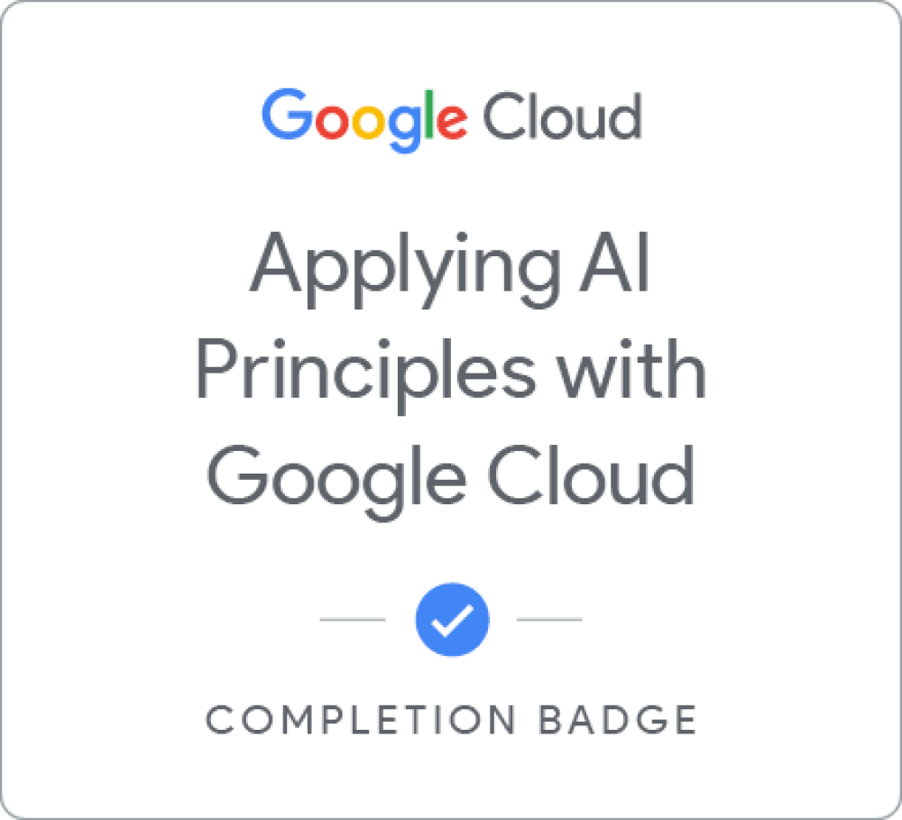
  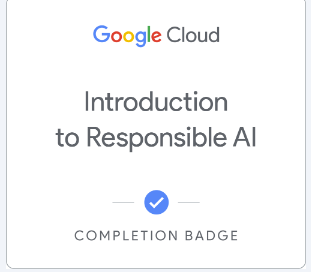

### 6. Looker Studio Essentials:  
Demonstrates proficiency in building interactive dashboards, transforming raw data into clear visual insights, and applying best practices for effective data storytelling. Validates hands‑on skills in connecting data sources, designing reports, and creating shareable analytics using Looker Studio’s visualization and reporting tools.

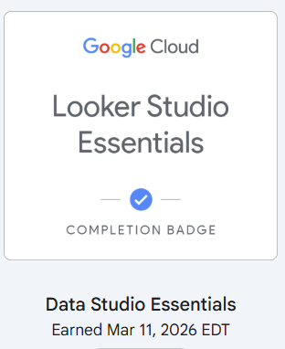

## LangGraph
**Google ADK**
**Multi-agent workflows**
**Memory, observability, security (STRIDE/Semgrep)**
**Specification-driven development**
**Multi-agent orchestration**
**HITL workflows**
**Long-term memory**
**Debugging & observability**
**Production-oriented agent development**

Links to verification pages

🔗 Quick Links
LinkedIn: https://www.linkedin.com/in/divya-shetty-k  

#💡 About Me
**AI Engineer specializing in Agentic AI, Multi-Agent Systems, LLM Applications, RAG, and AI Security. I build production-oriented AI agents using LangGraph, Gemini/Vertex AI, Google ADK, BigQuery, and Python, with strong foundations in testing, observability, and responsible AI.**
